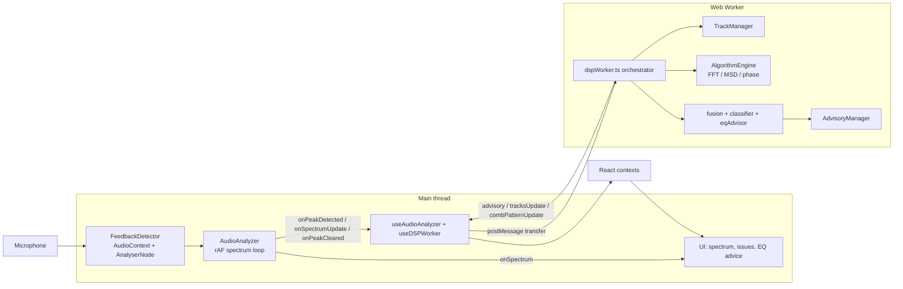

# Architecture

DoneWell Audio is a single-page [Next.js](https://nextjs.org/) 16 (App Router) +
React 19 + TypeScript application that listens to a microphone and flags likely
acoustic feedback / ringing, then suggests EQ moves. This document describes how the
pieces fit together.

> For the DSP engine internals see [`dsp-pipeline.md`](./dsp-pipeline.md). For the
> configuration model see [`settings.md`](./settings.md). For setup, scripts, and
> troubleshooting see [`development.md`](./development.md).

## Local-only by design

The app has **no backend, database, or external service**. Everything — audio capture,
analysis, and the UI — runs in the browser. There are no API routes, no network calls,
no telemetry, and no persisted data beyond browser `localStorage` (for settings).

This constraint is enforced in CI by `pnpm verify:local-only`
(`scripts/verify-local-only.mjs`), which fails the build if backend/network code
(Supabase, Sentry, `fetch`/`XHR`/`WebSocket`, API routes, ML runtimes, etc.) is
reintroduced. See the [verify:local-only runbook](./development.md#verifylocal-only-runbook).

## End-to-end data flow

1. **Capture (main thread).** `AudioAnalyzer` (`lib/audio/createAudioAnalyzer.ts`) wraps
   `FeedbackDetector` (`lib/dsp/feedbackDetector.ts`). It owns the Web Audio graph
   (`AudioContext` + `AnalyserNode`), runs a `requestAnimationFrame` loop, and emits
   callbacks: `onSpectrum` (~30 fps for display), `onSpectrumUpdate` (~10 fps for
   content-type detection), `onPeakDetected`, `onPeakCleared`, `onCombPatternDetected`,
   `onError`, and `onStateChange`.
2. **Bridge (React).** `useAudioAnalyzer` (`hooks/useAudioAnalyzer.ts`) wires the analyzer
   to the worker, owns the transport state machine, and delegates advisory bookkeeping to
   `useAdvisoryMap` and per-frame display state to `useAnalyzerFrameState`. The worker
   itself is managed by `useDSPWorker` (`hooks/useDSPWorker.ts`).
3. **Analysis (worker).** `dspWorker.ts` orchestrates `TrackManager`, the `AlgorithmEngine`
   (FFT/MSD/phase), the six-algorithm fusion, the classifier, the EQ advisor, and
   `AdvisoryManager`. It returns advisories and track summaries to the main thread.
4. **Presentation (React contexts → components).** Results flow into a set of React
   contexts that feed the spectrum canvas, the issues list, and the EQ recommendations.

## Threading model

Work is split across the main thread and a Web Worker. The boundary is deliberate:
the Web Audio API can only be driven from the main thread, while the CPU-heavy per-peak
DSP runs off the main thread to keep the UI at frame rate.

| Responsibility | Owner |
| --- | --- |
| `AudioContext`, `AnalyserNode`, `getFloatFrequencyData()` | Main thread |
| `requestAnimationFrame` loop, spectrum display data | Main thread (`AudioAnalyzer`) |
| Transport state (`isRunning`/`isStarting`/`error`/`workerError`) | Main thread (`useAudioAnalyzer`) |
| `TrackManager` state + active tracks | Worker |
| Detection algorithms + fusion + classification | Worker |
| Advisory map (dedup, harmonic suppression, cooldowns) | Worker (`AdvisoryManager`) |
| EQ advisory generation | Worker (`eqAdvisor.ts`) |

Spectrum and time-domain buffers are passed to the worker as **transferable**
`ArrayBuffer`s (zero-copy) and handed back via a `returnBuffers` message for reuse. See
[`dsp-pipeline.md`](./dsp-pipeline.md#zero-copy-buffer-transfer) for details, including the
backpressure queue and worker crash-recovery behavior.

## React context layout

`AudioAnalyzerProvider` (`contexts/AudioAnalyzerContext.tsx`) builds its value from
`useAnalyzerContextState` and splits it into four focused contexts so components only
re-render on the slices they consume:

| Context | Provides |
| --- | --- |
| `EngineContext` | Transport (`start`/`stop`/`switchDevice`), device list/selection, the `dspWorker` handle, `isRunning`/`isStarting`/`error`/`workerError` |
| `SettingsContext` | Derived `settings`, the layered `session`/`displayPrefs`, and semantic setting actions (`setMode`, `setSensitivityOffset`, …) |
| `MeteringContext` | `spectrumRef`/`tracksRef`, noise floor, sample rate, FFT size, input level, auto-gain state |
| `DetectionContext` | `advisories` and `earlyWarning` |

Two more contexts wrap the inner tree from `components/analyzer/AudioAnalyzer.tsx`:
`AdvisoryProvider` (`contexts/AdvisoryContext.tsx`) and `UIProvider`
(`contexts/UIContext.tsx`), plus `PortalContainerContext` for portal targets.

## Entry point

`app/page.tsx` renders `AudioAnalyzerClient`
(`components/analyzer/AudioAnalyzerClient.tsx`), which dynamically imports the main
`AudioAnalyzer` component with `ssr: false`. Client-only rendering is required because the
analyzer depends on browser APIs (Web Audio, Web Workers, `localStorage`) that are not
available during server rendering. An `ErrorBoundary` wraps the analyzer.

## Directory map

| Path | Contents |
| --- | --- |
| `app/` | Next.js App Router entry (`page.tsx`, `layout.tsx`, `global-error.tsx`, `globals.css`, offline route) |
| `components/analyzer/` | The analyzer UI: header bar, layouts (mobile/desktop), spectrum canvas, issue cards, faders, settings panels |
| `components/ui/` | Low-level UI primitives (button, sliders, toggle, tooltip, spinner) |
| `contexts/` | React context providers (Engine/Settings/Metering/Detection/Advisory/UI/PortalContainer) |
| `hooks/` | React hooks, incl. `useAudioAnalyzer`, `useDSPWorker`, `useLayeredSettings`, and per-panel state hooks |
| `lib/audio/` | `AudioAnalyzer` (Web Audio setup + spectrum loop) |
| `lib/dsp/` | The DSP engine: worker, detector, algorithms, fusion, classifier, advisory manager, EQ advisor |
| `lib/canvas/` | Spectrum / GEQ-bar canvas drawing helpers |
| `lib/settings/` | Layered settings: mode baselines, derivation, runtime-key picking, defaults |
| `lib/storage/` | `localStorage` wrappers (v2 layered settings storage) |
| `lib/fader/`, `lib/inputMeter/` | Fader math and input-meter math |
| `lib/utils/` | Pitch/EQ display helpers, math helpers, logger |
| `types/` | Shared type definitions (`advisory.ts`, `settings.ts`) |
| `scripts/` | `verify-local-only.mjs` (CI gate), `build-dmg.mjs` (macOS packaging) |
| `tests/` | Cross-cutting tests (`dsp/`, `integration/`, `helpers/`) and Vitest setup |
| `public/` | Static assets, icons, manifest, and the local service worker |
