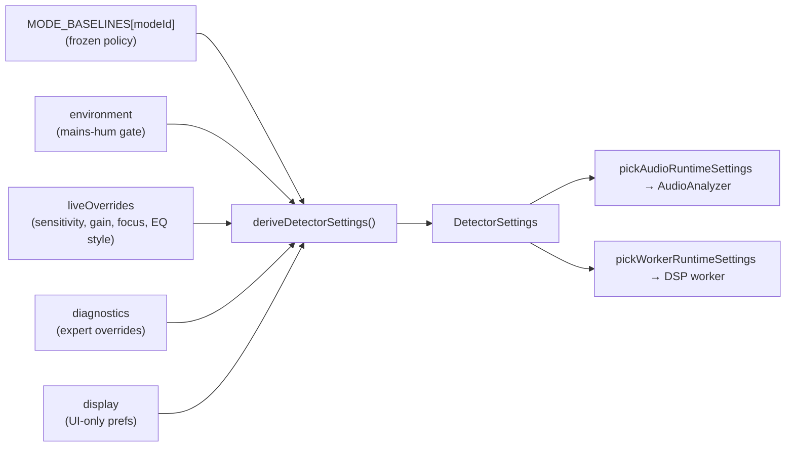

# Settings model

DoneWell Audio uses a **layered settings model**: a small amount of user-facing state is
composed into the flat `DetectorSettings` object that the DSP pipeline consumes. This keeps
the UI controls semantic ("set mode", "nudge sensitivity") while the engine receives one
fully-resolved configuration.

## Layers

The layered state (`DwaSessionState` + `DisplayPrefs`, see `types/settings.ts`) is held by
`useLayeredSettings` (`hooks/useLayeredSettings.ts`). Composition order
(`lib/settings/deriveSettings.ts`):

1. **Mode baseline** — frozen detector policy for the selected mode (`MODE_BASELINES`).
2. **Live overrides** — operator adjustments (sensitivity offset, input gain, focus range,
   EQ style, auto-gain).
3. **Diagnostics overrides** — expert-only field replacements.
4. **Display preferences** — UI-only; never affect detection.

`deriveDetectorSettings()` is a **pure** function (no side effects), so it runs safely in a
React `useMemo` and in tests.

## Operation modes

`MODE_BASELINES` (`lib/settings/modeBaselines.ts`) defines one baseline per mode. Selected
threshold/range values:

| Mode | Use case | Feedback thr. (dB) | Range (Hz) | FFT | EQ preset |
| --- | --- | --- | --- | --- | --- |
| `speech` | Corporate & conference | 20 | 150–10 000 | 8192 | surgical |
| `worship` | House of worship | 35 | 100–12 000 | 8192 | surgical |
| `liveMusic` | Concerts & events | 42 | 60–16 000 | 4096 | heavy |
| `theater` | Drama & musicals | 28 | 150–10 000 | 8192 | surgical |
| `monitors` | Stage wedges | 15 | 200–6 000 | 4096 | surgical |
| `broadcast` | Studio & podcast | 22 | 80–12 000 | 8192 | surgical |
| `outdoor` | Open air & festivals | 38 | 100–12 000 | 4096 | heavy |

> The full per-mode policy (sustain/clear timing, confidence, prominence, A-weighting,
> track timeout, default gain) lives in `modeBaselines.ts`. Switching modes resets live
> overrides but preserves input-gain / auto-gain settings (see `setMode`).

## Derivation highlights

From `deriveDetectorSettings`:

- **Effective threshold** = `baseline.feedbackThresholdDb + live.sensitivityOffsetDb`,
  floored at `MIN_THRESHOLD_DB` (1 dB). Stored legacy "environment" threshold offsets are
  ignored in the local-only analyzer.
- **Focus range** resolves from `live.focusRange`: `mode-default` (baseline range), a named
  `preset` (`vocal` 150–10 000, `monitor` 200–6 000, `full` 60–16 000, `sub` 20–300), or a
  `custom` min/max.
- **EQ style** uses the live `eqStyle` unless it is `mode-default`, in which case the
  baseline preset applies.
- **Diagnostics overrides** (when set) replace baseline values for confidence, growth-rate,
  smoothing, sustain/clear, prominence, ring threshold, FFT size, A-weighting, etc.
- **Display preferences** are copied through onto `DetectorSettings` for convenience but are
  never sent to the worker.

## Runtime split: audio vs worker

`DetectorSettings` is wider than either consumer needs, so `lib/settings/runtimeSettings.ts`
provides two projections:

- `pickAudioRuntimeSettings(settings)` → `AudioRuntimeSettings` (`AUDIO_RUNTIME_KEYS`): the
  keys the main-thread `AudioAnalyzer` / `FeedbackDetector` need (FFT, frequency range,
  thresholds, gain, noise-floor timing, etc.).
- `pickWorkerRuntimeSettings(settings)` → `WorkerRuntimeSettings` (`WORKER_RUNTIME_KEYS`):
  a larger set that additionally includes algorithm/diagnostics keys
  (`algorithmMode`, `enabledAlgorithms`, `adaptivePhaseSkip`, `maxTracks`, `peakMergeCents`,
  the `*GateOverride` knobs, `mainsHum*`, …).

`useAudioAnalyzer` re-applies both projections whenever the derived settings change, calling
`analyzer.updateSettings(...)` and `dspWorker.updateSettings(...)`.

## Semantic actions

`useLayeredSettings` exposes intent-based mutators (surfaced via `SettingsContext`):

`setMode`, `setSensitivityOffset`, `setInputGain`, `setAutoGain`, `setFocusRange`,
`setEqStyle`, `updateDisplay`, `updateDiagnostics`, `updateLiveOverrides`, and `resetAll`.

All inputs are validated/clamped on write (and again on load). Selected ranges:

| Field | Range |
| --- | --- |
| `sensitivityOffsetDb` | −30 … 30 |
| `inputGainDb` | −40 … 40 |
| `autoGainTargetDb` | −48 … −3 |
| `maxTracks` | 8 … 128 |
| `trackTimeoutMs` | 200 … 5000 (or `mode-default`) |
| `harmonicToleranceCents` | 25 … 400 |
| `peakMergeCents` | 10 … 200 |
| `confidenceThresholdOverride` | 0.2 … 0.8 |
| `maxDisplayedIssues` | 1 … 24 |
| Gate overrides (`combSweep`/`ihr`/`ptmr`/…) | 0 … 1 |

See `sanitizeLiveOverrides` / `sanitizeDiagnostics` / `sanitizeDisplayPrefs` in
`useLayeredSettings.ts` for the complete list.

## Diagnostics / expert gate overrides

The diagnostics layer can override the fusion engine's music-suppression gates:
`combSweepOverride`, `ihrGateOverride`, `ptmrGateOverride` (and `formantGateOverride`,
`chromaticGateOverride`, `mainsHumGateOverride`). These flow through `WorkerRuntimeSettings`
and are passed into `fuseAlgorithmResults` as `gateOverrides`, letting expert users tune the
penalties described in [`dsp-pipeline.md`](./dsp-pipeline.md#fusion-engine). They are
clamped to `[0, 1]` and are undefined (no override) by default.

## Persistence

Layered state is persisted to `localStorage` via `lib/storage/settingsStorageV2.ts`
(a clean v2 namespace — no migration from any v1 keys):

| Key | Contents |
| --- | --- |
| `dwa-v2-session` | Active session: mode + environment + live overrides + diagnostics |
| `dwa-v2-display` | Display preferences (separate lifecycle from rig state) |
| `dwa-v2-presets` | Structured rig presets |
| `dwa-v2-startup` | Which preset to auto-load on launch |

Writes are debounced 100 ms (good for slider drags). On first mount, a `FRESH_START`
session is used instead of the stored one in specific cases (no prior session, or an
untouched default speech session) so new users get sensible defaults. `resetAll` cancels any
in-flight debounced write before saving defaults, preventing a stale write from clobbering
the reset (a fixed race condition).
